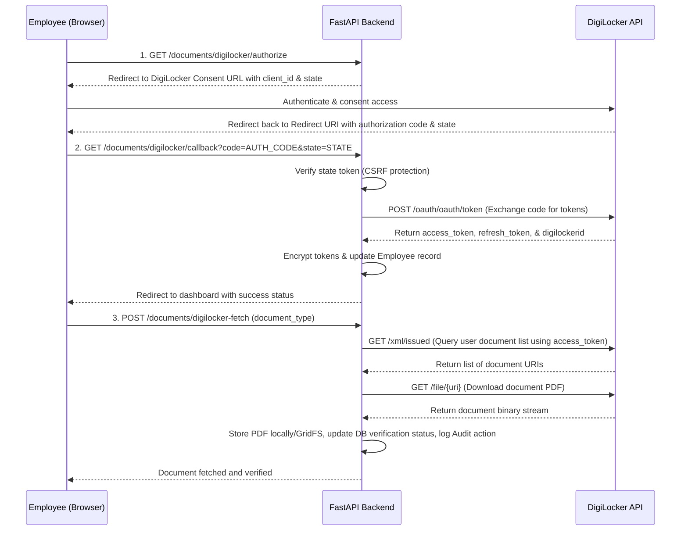

# Implementation Plan: DigiLocker Integration in DVP

This document outlines the requirements, architectural flows, database schemas, router configurations, and implementation details necessary to integrate DigiLocker into the Digital Verification Portal (DVP).

---

## 1. Prerequisites & Credentials

To enable communication with the DigiLocker API, you must register your application on the [DigiLocker Partner Portal](https://partners.digitallocker.gov.in/) to obtain sandbox and production credentials:

*   **`DIGILOCKER_CLIENT_ID`**: The unique client identifier assigned to DVP.
*   **`DIGILOCKER_CLIENT_SECRET`**: The client secret used to authenticate token requests.
*   **`DIGILOCKER_REDIRECT_URI`**: The callback URL registered in the developer portal. This must match the endpoint configured in DVP (e.g., `https://api.dvp.com/api/v1/documents/digilocker/callback`).

---

## 2. Integration Architecture Flow

The integration implements the standard **OAuth 2.0 Authorization Code Flow** to securely link user accounts and download documents.



---

## 3. Implementation Guide

### 3.1 Configuration settings
Add variables to `.env` and load them into `app/core/config/settings.py` so they are available application-wide:

```python
# app/core/config/settings.py

# DigiLocker Configuration
DIGILOCKER_CLIENT_ID: Optional[str] = None
DIGILOCKER_CLIENT_SECRET: Optional[str] = None
DIGILOCKER_REDIRECT_URI: Optional[str] = None
DIGILOCKER_API_BASE_URL: str = "https://developers.digitallocker.gov.in/public/oauth2/1"
DIGILOCKER_AUTH_URL: str = "https://accounts.digitallocker.gov.in/oauth/oauth/authorize"
DIGILOCKER_TOKEN_URL: str = "https://accounts.digitallocker.gov.in/oauth/oauth/token"
```

### 3.2 Database Schema Update
Modify the `Employee` model inside PostgreSQL schema to store OAuth session credentials securely:

```python
# app/models/employee.py
from sqlalchemy import Column, String, DateTime

class Employee(Base):
    # ... existing fields ...
    digilocker_id = Column(String, nullable=True, unique=True)
    digilocker_access_token = Column(String, nullable=True)     # Recommended: Encrypted at rest
    digilocker_refresh_token = Column(String, nullable=True)    # Recommended: Encrypted at rest
    digilocker_token_expires_at = Column(DateTime, nullable=True)
```

### 3.3 Router Handlers
Implement the initiation redirect and the callback hook inside `app/routes/documents.py`:

```python
# app/routes/documents.py
from fastapi.responses import RedirectResponse
import httpx

@router.get("/digilocker/authorize")
async def digilocker_authorize(current_user: User = Depends(get_current_user)):
    """
    Step 1: Redirect the user to the DigiLocker Consent Screen
    """
    state = generate_secure_state(current_user.id) # CSRF state validation token
    
    auth_url = (
        f"{settings.DIGILOCKER_AUTH_URL}"
        f"?response_type=code"
        f"&client_id={settings.DIGILOCKER_CLIENT_ID}"
        f"&redirect_uri={settings.DIGILOCKER_REDIRECT_URI}"
        f"&state={state}"
    )
    return RedirectResponse(url=auth_url)

@router.get("/digilocker/callback")
async def digilocker_callback(
    code: str, 
    state: str, 
    db: AsyncSession = Depends(get_db)
):
    """
    Step 2: Handle OAuth Callback, exchange authorization code for access token,
    and associate it with the employee.
    """
    employee_id = verify_state_token(state)
    if not employee_id:
        raise HTTPException(status_code=400, detail="Invalid state token")

    async with httpx.AsyncClient() as client:
        response = await client.post(
            settings.DIGILOCKER_TOKEN_URL,
            data={
                "code": code,
                "grant_type": "authorization_code",
                "client_id": settings.DIGILOCKER_CLIENT_ID,
                "client_secret": settings.DIGILOCKER_CLIENT_SECRET,
                "redirect_uri": settings.DIGILOCKER_REDIRECT_URI,
            }
        )
        if response.status_code != 200:
            raise HTTPException(status_code=400, detail="DigiLocker token exchange failed")
        
        token_data = response.json()
        
        # Save credentials (encrypting access/refresh tokens is recommended)
        await employee_repository.update_digilocker_credentials(
            db, 
            employee_id=employee_id, 
            digilocker_id=token_data["digilockerid"],
            access_token=token_data["access_token"],
            expires_in=token_data.get("expires_in")
        )
        
    return RedirectResponse(url="/dashboard?digilocker=success")
```

### 3.4 Service Integration
Replace mock functionality inside `app/services/document_service.py` to query physical APIs:

```python
# app/services/document_service.py
import httpx

@staticmethod
async def fetch_from_digilocker(
    db: AsyncSession, employee_id: int, document_type: DocumentType, actor_id: Optional[int] = None
) -> Document:
    emp = await employee_repository.get(db, employee_id)
    if not emp or not emp.digilocker_access_token:
        raise HTTPException(status_code=400, detail="Employee not linked with DigiLocker")

    headers = {"Authorization": f"Bearer {emp.digilocker_access_token}"}
    async with httpx.AsyncClient() as client:
        # 1. Fetch available issued documents
        res = await client.get(f"{settings.DIGILOCKER_API_BASE_URL}/xml/issued", headers=headers)
        if res.status_code != 200:
            raise HTTPException(status_code=400, detail="Failed to retrieve DigiLocker documents")
            
        # Parse XML response to find target document URI (e.g. AADHAR, PAN)
        document_uri = parse_digilocker_response_for_type(res.text, document_type)
        if not document_uri:
            raise HTTPException(status_code=404, detail="Requested document type not found in DigiLocker")

        # 2. Download document PDF
        pdf_res = await client.get(f"{settings.DIGILOCKER_API_BASE_URL}/file/{document_uri}", headers=headers)
        if pdf_res.status_code != 200:
             raise HTTPException(status_code=400, detail="Failed to download file from DigiLocker")

        # 3. Save PDF local file
        file_name = f"digilocker_{document_type.value.lower()}.pdf"
        file_path = save_pdf_to_uploads(employee_id, file_name, pdf_res.content)
        
        # 4. Create database records & update status
        doc_in = DocumentCreate(
            employee_id=employee_id,
            document_type=document_type,
            file_name=file_name,
            file_url=file_path,
        )
        doc = await document_repository.create(db, obj_in=doc_in)
        doc.verification_status = VerificationStatus.VERIFIED
        doc.remarks = "Automatically fetched and verified via DigiLocker production API."
        
        db.add(doc)
        await db.commit()
        await db.refresh(doc)
        
        # Log event details
        await audit_log_service.log_action(
            db=db, actor_id=actor_id, action="FETCH_DIGILOCKER",
            entity_type="Document", entity_id=doc.id,
            new_value={"type": document_type.value, "source": "DigiLocker"}
        )
        return doc
```

---

## 4. Best Practices & Security Guidelines

*   **Encryption at Rest**: Encrypt OAuth access and refresh tokens using symmetric keys (`cryptography.fernet`) before persisting to PostgreSQL.
*   **Token Expiry & Re-authorization**: Check token expiration (`digilocker_token_expires_at`). Exchange the refresh token for a new access token dynamically if expired.
*   **CSRF Protection**: Generate a secure, signed state string during redirection and verify it on callback.
*   **Rate Limits and Failures**: Standardize retry limits and fallback schemas for external API down-times.
